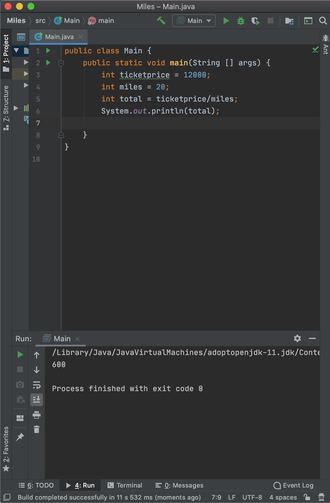

Miles.java
Был написан код 
public class Main {
    public static void main(String [] args) {
        int ticketprice = 12000;
        int miles = 20;
        int total = ticketprice/miles;
        System.out.println(total);
        
    }
}
Результат: 

